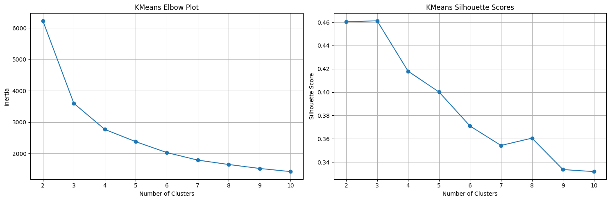
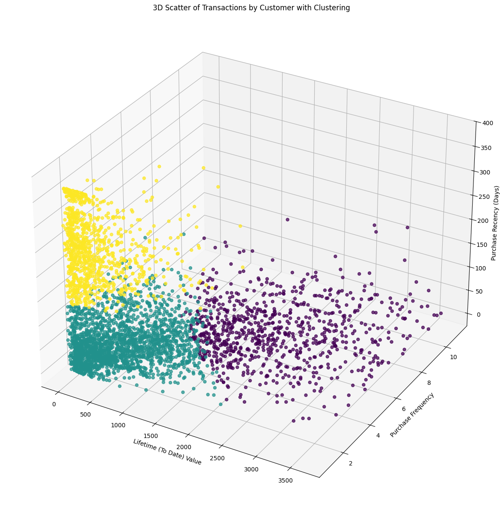
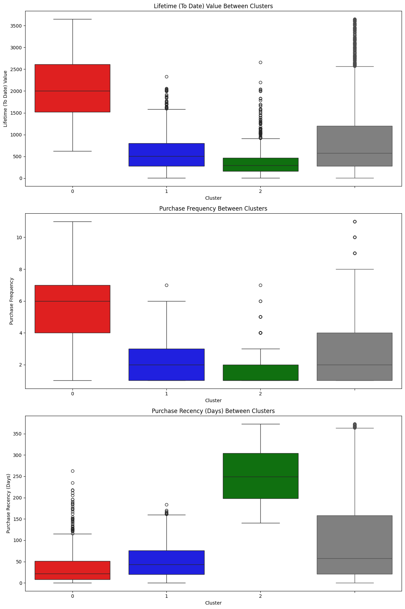
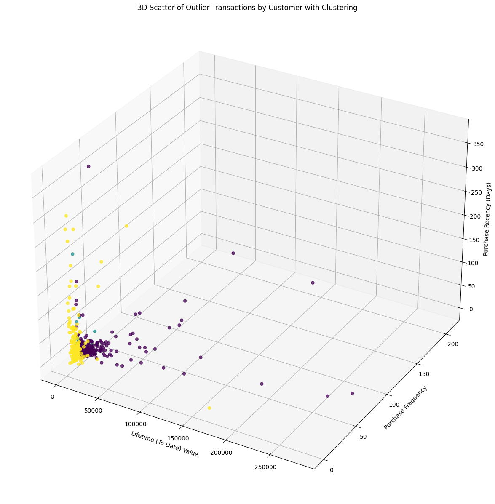
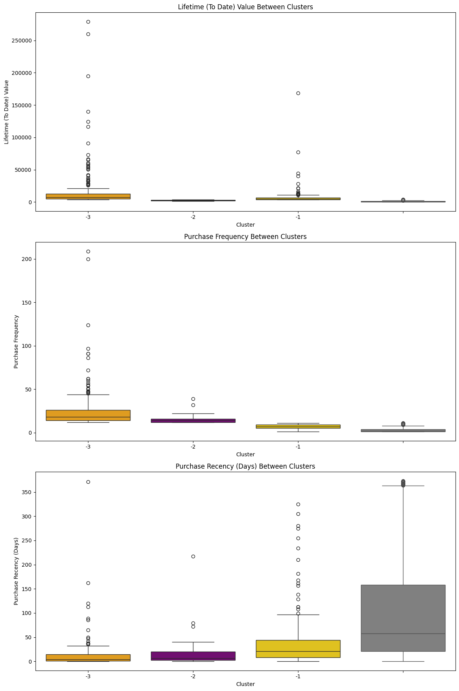
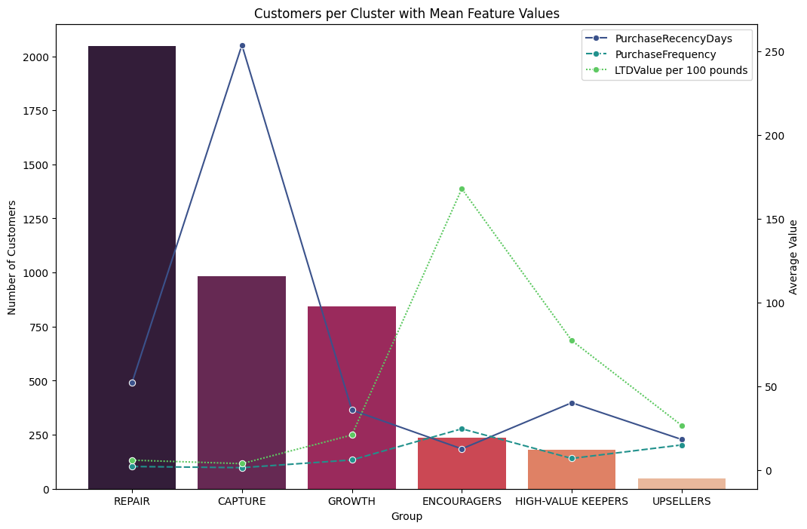

# Retail Store Analysis

## Table of Contents 
1. [Introduction](#introduction)
2. [Takeaways Summary](#takeaways-summary)
3. [Data](#data)
4. [Exploration](#exploration)
5. [Cleaning](#cleaning)
6. [Feature Engineering](#feature-engineering)
7. [KMeans Clustering](#kmeans-clustering)
8. [Takeaways](#takeaways)

---
## Introduction
Using UK online retail data from 2009 to 2011, I will conduct a hypothetical data science project starting from data exploration and ending in model development and deployment. The modeling goal of this project is to cluster the store's customers into different groups to better tailor their retention and marketing policies.

### Role
For this project, I am acting as a data analyst for a large UK-based online retail store. In this case, rather than making specific predictions, I am interested in understanding the best way to group the store's customers so that they can develop targeted marketing plans for each group. 

### Domain Background
U.K. retail e-commerce sales reached $482.6 million in 2009, up from a revised $400 million in 2008—an annual gain of approximately 20% percent. From 2002 to 2009, retail e-sales increased at an average annual growth rate of 18.1 percent in the US and similarly in other Western economies, compared with 2.2 percent for total retail sales. Of course, with hindsight in 2024, the online retail space would only continue to grow. Today, more than ever before, it is important for online stores to understand their customers segments in order to gain a competitive advantage in the hyper-crowded online marketplace. 

---
## Takeaways Summary
Through exploratory analysis, I identified 3 outlier clusters: high spenders, frequent spenders, and high/frequent spenders. After removing them from the data, the KMeans clustering model yielded 3 additional clusters. After examining and comparing the distributions of each cluster, I came up with a preliminary targeting plan to properly address the main trends of each group. Of course, this data would be even better synthesized by a marketing analyst who could design full-fledged targeted campaigns for each cluster. The full description of each cluster and my plan for each one can be found in the [Takeaways section](#takeaways).

---
## Data
I used the [UK online retail data set from the UCI Machine Learning Repository](https://archive.ics.uci.edu/dataset/352/online+retail) for this project. This description page for this data lists the following information about the data: 

This is a transactional data set which contains all the transactions occurring between 01/12/2010 and 09/12/2011 for a UK-based and registered non-store online retail. The company mainly sells unique all-occasion gifts. Many customers of the company are wholesalers. Each row represents a transaction between a particular customer and the online store.

**Variables:**

| Variable Name | Role | Type | Description	Units | Missing Values |
|---------------|------|------|-------------------|----------------|
| InvoiceNo | ID | Categorical | A 6-digit integral number uniquely assigned to each transaction. If this code starts with letter 'c', it indicates a cancellation | No |
| StockCode | ID | Categorical | A 5-digit integral number uniquely assigned to each distinct product | No |
| Description | ID | Categorical | Product name | No |
| Quantity | Feature | Integer | The quantities of each product (item) per transaction | No |
| InvoiceDate | Feature | Date | The dat and time when each transaction was generated | No |
| UnitPrice | Feature | Continuous | Product price per unit sterling | No |
| CustomerID | Feature | Categorical | A 5-digit integral number uniquely assigned ot each customer | No |
| Country | Feature | Categorical | The name of the country where each customer resides | No |

**Additional Variable Information:**
- InvoiceNo: Invoice number. Nominal, A 6-digit integral number uniquely assigned to each transaction. **If this code starts with letter 'c', it indicates a cancellation.** 
- StockCode: Product (item) code. Nominal, a 5-digit integral number uniquely assigned to each distinct product.
- Description: Product (item) name. Nominal.
- Quantity: The quantities of each product (item) per transaction. Numeric.	
- InvoiceDate: Invoice Date and time. Numeric, The day and time when each transaction was generated.
- UnitPrice: Unit price. Numeric, Product price per unit in sterling.
- CustomerID: Customer number. Nominal, A 5-digit integral number uniquely assigned to each customer.
- Country: Country name. Nominal, The name of the country where each customer resides.
---

Even before conducting my own exploration, I could tell that I would need to clean, at the very least, the 'InvoiceNo' column to remove cancelled transactions. Since the goal of this project is to cluster **paying** customers, I would have to remove any observations that did not result in revenue or that could not be segmented by customer.

---
## Exploration
My step-by-step process of exploring the data can be found in `notebooks/explore.ipynb`. 

After finding, reading about, and loading in the data, I began exploring the data. The original data set consisted of 541,909 observations and 8 variables. Each observation represented a specific invoice, or order. There were no incorrect data types present, though I did end up converting 'CustomerID' to a string value for aggregation.

There were 1454 NA values for 'Description' and **135080** NA values for 'CustomerID'. NA values for 'CustomerID' are transactions in which we do not know which customer made the purchase. Because we are looking to segment our customers using a clustering algorithm, these observations are unusable and should be removed.

The original data set had the following descriptive statistics:

|       | Quantity      | InvoiceDate                   | UnitPrice     | CustomerID    |
|-------|---------------|-------------------------------|---------------|---------------|
| count | 541909.000000 | 541909                        | 541909.000000 | 406829.000000 |
| mean  | 9.552250      | 2011-07-04 13:34:57.156386048 | 4.611114      | 15287.690570  |
| min   | -80995.000000 | 2010-12-01 08:26:00           | -11062.060000 | 12346.000000  |
| 25%   | 1.000000      | 2011-03-28 11:34:00           | 1.250000      | 13953.000000  |
| 50%   | 3.000000      | 2011-07-19 17:17:00           | 2.080000      | 15152.000000  |
| 75%   | 10.000000     | 2011-10-19 11:27:00           | 4.130000      | 16791.000000  |
| max   | 80995.000000  | 2011-12-09 12:50:00           | 38970.000000  | 18287.000000  |
| std   | 218.081158    | NaN                           | 96.759853     | 1713.600303   |

This table highlights some clear oddities with the uncleaned data. Firstly, 'Quantity' has a negative minimum, meaning there is at least one observation that has a negative quantity. In the context of customer purchases, this may indicate a return or some other type of non-standard transaction and needs to be filtered out before clustering. We see the see the same issue with 'UnitPrice' where there is a minimum value of -11,062 sterling. 

The descriptive statistics of the qualitative columns also yielded some insights. 

|        | InvoiceNo | StockCode | Description                        | Country        |
|--------|-----------|-----------|------------------------------------|----------------|
| count  | 541909    | 541909    | 540455                             | 541909         |
| unique | 25900     | 4070      | 4223                               | 38             |
| top    | 573585    | 85123A    | WHITE HANGING HEART T-LIGHT HOLDER | United Kingdom |
| freq   | 1114      | 2313      | 2369                               | 495478         |

It looks like there are more 'StockCode's than just regular 5 digit codes. We will need to investigate further to see what the 'A' refers to and if there are other non-standard codes. 

After looking at the descriptive statistics of each column, I examined each column individually. After examining the 'InvoiceNo' column, I found that, in addition to the 'C' numbers, there were also numbers starting with 'A' that represented debt adjustments. Before clustering, both the 'C' and 'A' invoice numnbers will need to be removed.

Next, I examined the 'StockCode' column. After some inspection, I found that there were two types of non-standard codes. First, there were codes that had a 5 digit number followed by a letter. These all seemed to be legitimate transactions that had been labeled differently for some reason. I also found 33 non-numeric codes that seemed to be special, non-customer related charges. After going through and examining each code, I found that only the code 'M' was legitimate and that rest of the non-standard "word" codes should be dropped. 

The 'InvoiceDate' column did not have any errors that needed corrected, so I decided to move on after calculating the range of the column (373 days). 

Similar to 'InvoiceDate', 'Country' did not have any data quality issues. I decided to visualize the store's most frequent customers by country, as shown below:

After looking at 'Country', I found that all NA 'Description' values had a corresponding 'CustomerID' NA value, so they would be taken care of by simply dropping all 'CustomerID' NA values. 

The 'Quantity' column had several negative values, but they all corresponded to either cancelled orders or NA customers.

The only negative 'UnitPrice' values were for the debt adjustments. However, there were 40 transactions that had a unit price of 0 and a valid customer ID. These will need to be removed before clustering as they represent transactions that generated no revenue. 

Lastly, I confirmed that, other than the NA values, the 'CustomerID' column was usable-- which it was.

---
## Cleaning
My full cleaning process can be found in `notebooks/cleaning.ipynb`.

From my exploration, I knew that there were several columns we needed to clean. Specifically:

    1. Remove InvoiceNo values with "C" or "A" values in them.
    2. Remove all StockCodes that are not 6 digits or 6 digits followed by a letter except for the "M" codes.
    3. Drop all NA 'CustomerID' values (this will also deal with all 'Description' and 'Quanitity' oddities).
    4. Remove 40 additional rows that contain items with a Price value of 0 after dropping NA customers.

The cleaned data had 3996,621 observations. After all cleaning procedures, we had removed a little over 25% of the data.

---
## Feature Engineering
My full feature engineering process can be found in `notebooks/engineering.ipynb`.

After cleaning the data, I needed to aggregate it on a customer level so that we could cluster each customer based on specific variables. I decided to look at three engineered variables:
- Lifetime To-Date Value (LTDValue): The total revenue generated by a particular customer across all of their transactions (revenue calculated by taking 'Quantity' * 'UnitPrice' columns).
- Purchasing Frequency (PurchaseFrequency): The number of times each customer created an Invoice at the online store (the number of times they shopped at the online store over the date range of the data).
- Purchasing Regularity/Recency (PurchaseRecencyDays): How far away from the most recent purchase data has each customer last shopped (calculated by taking the days difference between an individual customer's maximum 'InvoiceDate' and the overall data's maximum 'InvoiceDate').

After creating the aggregated data, I extracted the 'LTDValue' and 'PurchaseFrequency' outliers to create separate groups for them. This process left me with 4 data sets:
1. A non-outliers grouped data set 
2. A 'LTDValue' outliers data set 
3. A 'PurhcaseFrequency' ouliers data set
4. A 'LTDValue' and 'PurchaseFrequency' outliers data set

---
## KMeans Clustering
To find the optimal k for my KMeans algorithm, I iteratively tested values of k between 2 and 10. Each algorithm was allowed to run 1000 times and had the same random state. After running for 1000 iterations, I calculated each model's inertia and silhouette score and plotted them to compare:

From the elbow plot above, it is clear that there is diminishing returns after 3 or 4 clusters. The silhouette plot indicates that 3 clusters had less overlapping than 4, so I chose to use a KMeans algorithm with 3 clusters. 

The final KMeans model yielded the following clusters:

I also examined the outliers at this point:

Final takeaways are summarized below.

---
## Takeaways
- RED[0] > **GROWTH**: This group has the highest lifetime value and seem to shop fairly frequently. However, they do not seem to be shopping relatively recently. We should focus on getting this group back into our store more regularly so they can continue generating value.

BLUE[1] > **REPAIR**: This group has relatively low lifetime value, low frequency, and low recency. We need to focus on getting this group more engaged in our store.

GREEN[2] > **CAPTURE** > This group seems to have shopped very recently though it may have been their first time or a one-off visit as their frequency and lifetime values are low. Since they've visited us recently, we should focus on capturing their business and converting them into recurring customers. 

ORANGE[-3] > **HIGH-VALUE KEEPERS** > These customers don't have the highest purchase recency but tend to buy fairly frequently and **very** expensively. We should focus on retaining this group at all costs as they consistently provide a high lifetime value. Consider special deals, promotions, or product offerings for this group. 

PURPLE[-2] > **UPSELLERS**: This group has a comparitvely low lifetime value but tend to spend frequently and recently. We should focus our nudges on these customers to encourage them to continue visiting our store and spending. Tailoring recommendations based on their previous purchases may prove helpful here.

GOLD[-1] > **ENCOURAGERS**: This group seems to spend a decent amount and have shopped fairly recently. However, they don't appear to shop as often as the UPSELLERS. We should focus on getting these customers into our store more frequently while keeping them happy with sales, promotions, and offers.

