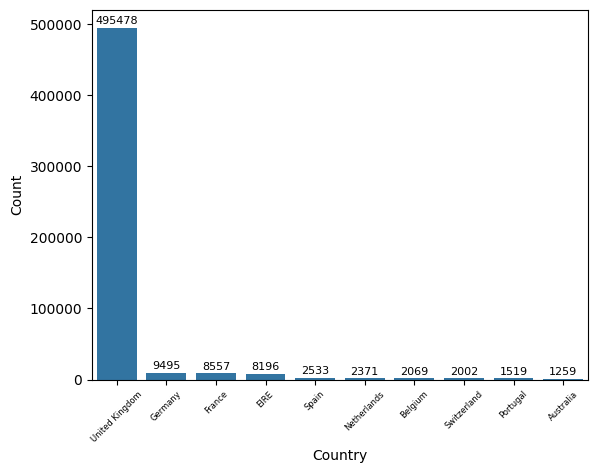

# Retail Store Analysis

Using UK online retail data from 2009 to 2011, I will conduct a hypothetical data science project starting from data exploration and ending in model development and deployment. The modeling goal of this project is to cluster the store's customers into different groups to better tailor their retention and marketing policies.

## Table of Contents 
1. [Data](#data)
2. [Exploration](#exploration)
3. [Cleaning](#cleaning)
4. [Feature Engineering](#feature-engineering)
5. [KMeans Clustering](#kmeans-clustering)
6. [Takeaways](#takeaways)

## Data
I used the [UK online retail data set from the UCI Machine Learning Repository](https://archive.ics.uci.edu/dataset/352/online+retail) for this project. This description page for this data lists the following information about the data: 

---
This is a transactional data set which contains all the transactions occurring between 01/12/2010 and 09/12/2011 for a UK-based and registered non-store online retail. The company mainly sells unique all-occasion gifts. Many customers of the company are wholesalers.

**Variables:**

| Variable Name | Role | Type | Description	Units | Missing Values |
|---------------|------|------|-------------------|----------------|
| InvoiceNo | ID | Categorical | A 6-digit integral number uniquely assigned to each transaction. If this code starts with letter 'c', it indicates a cancellation | No |
| StockCode | ID | Categorical | A 5-digit integral number uniquely assigned to each distinct product | No |
| Description | ID | Categorical | Product name | No |
| Quantity | Feature | Integer | The quantities of each product (item) per transaction | No |
| InvoiceDate | Feature | Date | The dat and time when each transaction was generated | No |
| UnitPrice | Feature | Continuous | Product price per unit sterling | No |
| CustomerID | Feature | Categorical | A 5-digit integral number uniquely assigned ot each customer | No |
| Country | Feature | Categorical | The name of the country where each customer resides | No |

**Additional Variable Information:**
- InvoiceNo: Invoice number. Nominal, A 6-digit integral number uniquely assigned to each transaction. **If this code starts with letter 'c', it indicates a cancellation.** 
- StockCode: Product (item) code. Nominal, a 5-digit integral number uniquely assigned to each distinct product.
- Description: Product (item) name. Nominal.
- Quantity: The quantities of each product (item) per transaction. Numeric.	
- InvoiceDate: Invoice Date and time. Numeric, The day and time when each transaction was generated.
- UnitPrice: Unit price. Numeric, Product price per unit in sterling.
- CustomerID: Customer number. Nominal, A 5-digit integral number uniquely assigned to each customer.
- Country: Country name. Nominal, The name of the country where each customer resides.
---

Even before conducting my own exploration, I could tell that I would need to clean, at the very least, the 'InvoiceNo' column to remove cancelled transactions. Since the goal of this project is to cluster **paying** customers, I would have to remove any observations that did not result in revenue or that could not be segmented by customer.

## Exploration
My step-by-step process of exploring the data can be found in `notebooks/explore.ipynb`. 

After finding, reading about, and loading in the data, I began exploring the data. The original data set consisted of 541,909 observations and 8 variables. Each observation represented a specific invoice, or order. There were no incorrect data types present, though I did end up converting 'CustomerID' to a string value for aggregation.

There were 1454 NA values for 'Description' and **135080** NA values for 'CustomerID'. NA values for 'CustomerID' are transactions in which we do not know which customer made the purchase. Because we are looking to segment our customers using a clustering algorithm, these observations are unusable and should be removed.

The original data set had the following descriptive statistics:

|       | Quantity      | InvoiceDate                   | UnitPrice     | CustomerID    |
|-------|---------------|-------------------------------|---------------|---------------|
| count | 541909.000000 | 541909                        | 541909.000000 | 406829.000000 |
| mean  | 9.552250      | 2011-07-04 13:34:57.156386048 | 4.611114      | 15287.690570  |
| min   | -80995.000000 | 2010-12-01 08:26:00           | -11062.060000 | 12346.000000  |
| 25%   | 1.000000      | 2011-03-28 11:34:00           | 1.250000      | 13953.000000  |
| 50%   | 3.000000      | 2011-07-19 17:17:00           | 2.080000      | 15152.000000  |
| 75%   | 10.000000     | 2011-10-19 11:27:00           | 4.130000      | 16791.000000  |
| max   | 80995.000000  | 2011-12-09 12:50:00           | 38970.000000  | 18287.000000  |
| std   | 218.081158    | NaN                           | 96.759853     | 1713.600303   |

This table highlights some clear oddities with the uncleaned data. Firstly, 'Quantity' has a negative minimum, meaning there is at least one observation that has a negative quantity. In the context of customer purchases, this may indicate a return or some other type of non-standard transaction and needs to be filtered out before clustering. We see the see the same issue with 'UnitPrice' where there is a minimum value of -11,062 sterling. 

The descriptive statistics of the qualitative columns also yielded some insights. 

|        | InvoiceNo | StockCode | Description                        | Country        |
|--------|-----------|-----------|------------------------------------|----------------|
| count  | 541909    | 541909    | 540455                             | 541909         |
| unique | 25900     | 4070      | 4223                               | 38             |
| top    | 573585    | 85123A    | WHITE HANGING HEART T-LIGHT HOLDER | United Kingdom |
| freq   | 1114      | 2313      | 2369                               | 495478         |

It looks like there are more 'StockCode's than just regular 5 digit codes. We will need to investigate further to see what the 'A' refers to and if there are other non-standard codes. 

After looking at the descriptive statistics of each column, I examined each column individually. After examining the 'InvoiceNo' column, I found that, in addition to the 'C' numbers, there were also numbers starting with 'A' that represented debt adjustments. Before clustering, both the 'C' and 'A' invoice numnbers will need to be removed.

Next, I examined the 'StockCode' column. After some inspection, I found that there were two types of non-standard codes. First, there were codes that had a 5 digit number followed by a letter. These all seemed to be legitimate transactions that had been labeled differently for some reason. I also found 33 non-numeric codes that seemed to be special, non-customer related charges. After going through and examining each code, I found that only the code 'M' was legitimate and that rest of the non-standard "word" codes should be dropped. 

The 'InvoiceDate' column did not have any errors that needed corrected, so I decided to move on after calculating the range of the column (373 days). 

Similar to 'InvoiceDate', 'Country' did not have any data quality issues. I decided to visualize the store's most frequent customers by country, as shown below:

After looking at 'Country', I found that all NA 'Description' values had a corresponding 'CustomerID' NA value, so they would be taken care of by simply dropping all 'CustomerID' NA values. 

The 'Quantity' column had several negative values, but they all corresponded to either cancelled orders or NA customers.

The only negative 'UnitPrice' values were for the debt adjustments. However, there were 40 transactions that had a unit price of 0 and a valid customer ID. These will need to be removed before clustering as they represent transactions that generated no revenue. 

Lastly, I confirmed that, other than the NA values, the 'CustomerID' column was usable-- which it was.

## Cleaning

## Feature Engineering

## KMeans Clustering

## Takeaways
